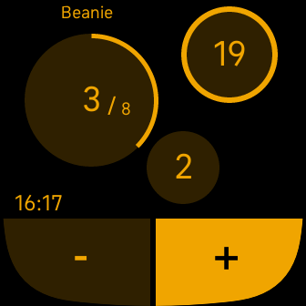

# Knit Counter

A counter for projects focused on tracking repeat increments (e.g. for knitting patterns).

Features:
* Keep track of total count, repeat progress and number of repeats completed
* Add new projects, each with its own name, colour and repeat length
* Swipe left to select a project to work on
* Manage projects via the settings app on your companion device (e.g phone)
* Reset counter to any value, or delete project when you're finished
* Option to show the current time
* Dark & light modes
* Doesn't time out automatically

If you find this app useful please consider [donating](https://www.paypal.com/donate/?business=LNHSWLLK7D8HJ&no_recurring=0&item_name=Support+development+of+Knit+Counter.&currency_code=AUD) to support me.

See this app on the [fitbit app gallery](https://gallery.fitbit.com/details/e09bd2a1-4168-4602-9879-5ebe82504c45).

## Screenshots

